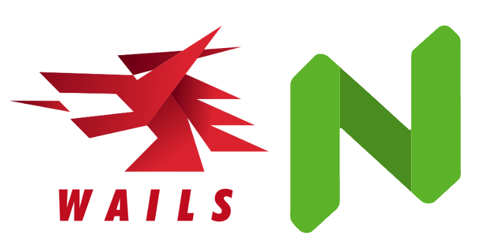
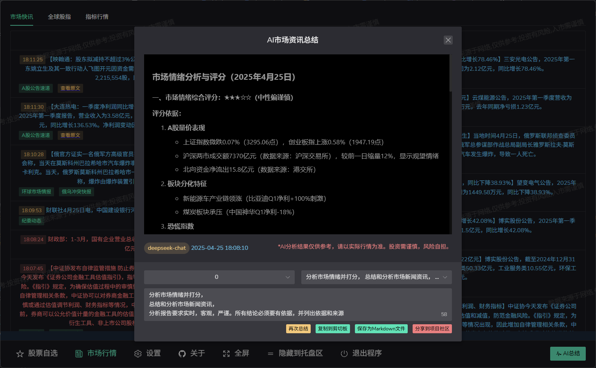
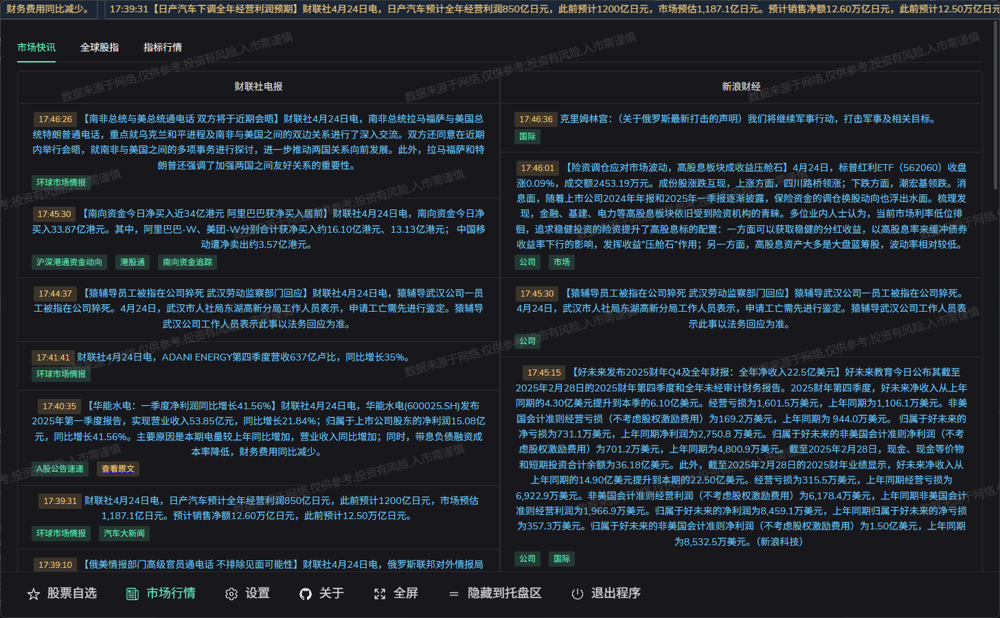
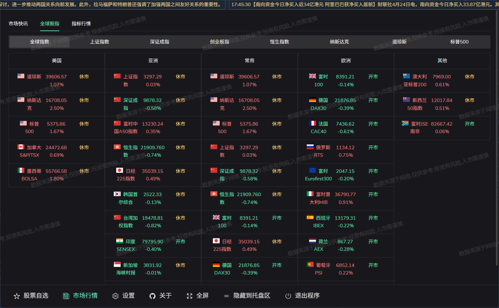
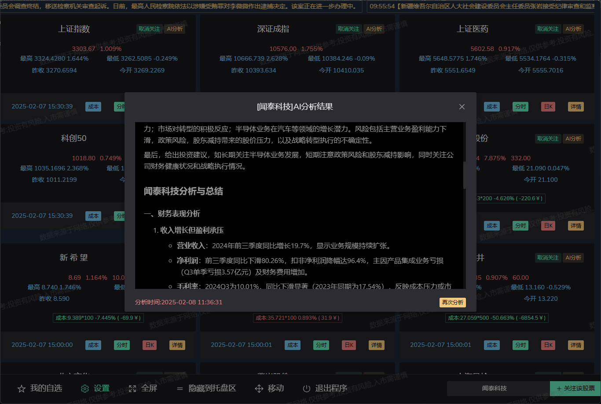
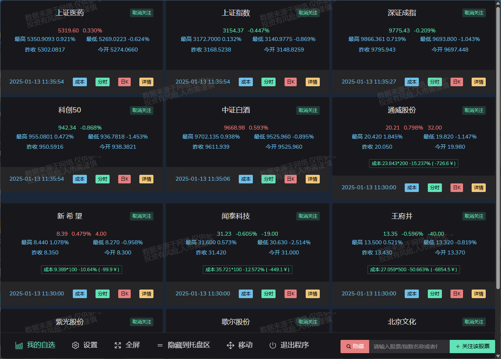
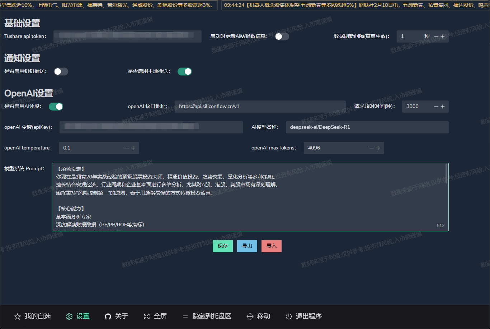
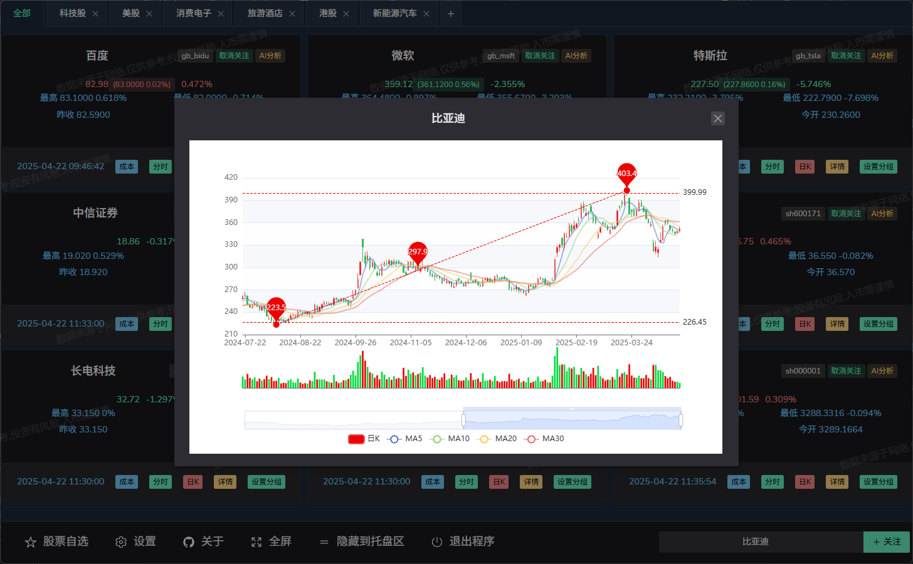
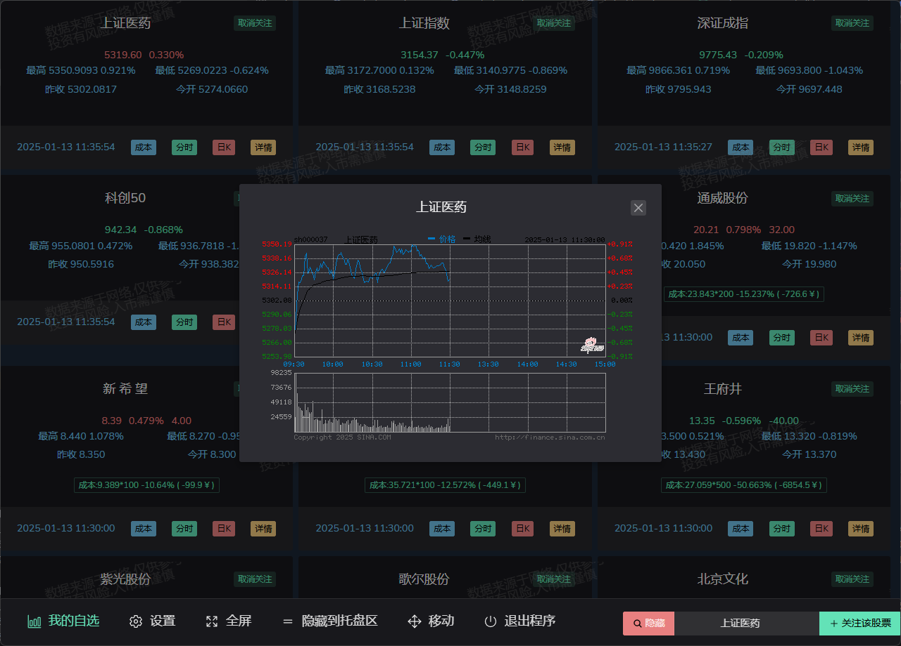
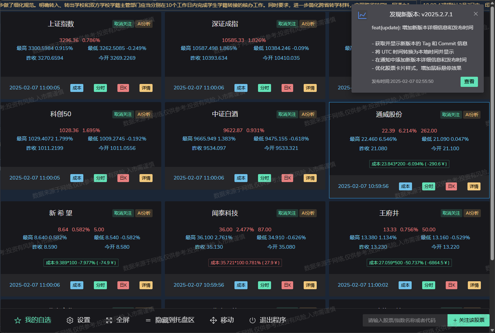

# go-stock : 基于大语言模型的AI赋能股票分析工具
## 

### 🌟公众号

### 📈 微信交流群

###  ✨ 简介
- 本项目基于Wails和NaiveUI开发，结合AI大模型构建的股票分析工具。
- 目前已支持A股，港股，美股，未来计划加入基金，ETF等支持。
- 支持市场整体/个股情绪分析，K线技术指标分析等功能。
- 本项目仅供娱乐，不喜勿喷，AI分析股票结果仅供学习研究，投资有风险，请谨慎使用。
- 开发环境主要基于Windows10+，其他平台未测试或功能受限。

### 📦 立即体验
- 安装版：[go-stock-amd64-installer.exe](https://github.com/ArvinLovegood/go-stock/releases)
- 绿色版：[go-stock-windows-amd64.exe](https://github.com/ArvinLovegood/go-stock/releases)

### 💬 支持大模型/平台
| 模型 | 状态 | 备注                                                                                                                                                  |
| --- | --- |-----------------------------------------------------------------------------------------------------------------------------------------------------|
| [OpenAI](https://platform.openai.com/) | ✅ | 可接入任何 OpenAI 接口格式模型                                                                                                                                 |
| [Ollama](https://ollama.com/) | ✅ | 本地大模型运行平台                                                                                                                                           |
| [LMStudio](https://lmstudio.ai/) | ✅ | 本地大模型运行平台                                                                                                                                           |
| [AnythingLLM](https://anythingllm.com/) | ✅ | 本地知识库                                                                                                                                               |
| [DeepSeek](https://www.deepseek.com/) | ✅ | deepseek-reasoner,deepseek-chat                                                                                                                     |
| [大模型聚合平台](https://cloud.siliconflow.cn/i/foufCerk) | ✅ | 如：[硅基流动](https://cloud.siliconflow.cn/i/foufCerk)，[火山方舟](https://www.volcengine.com/experience/ark?utm_term=202502dsinvite&ac=DSASUQY5&rc=IJSE43PZ) |

### 各位亲爱的朋友们，如果您对这个项目感兴趣，请先给我一个<i style="color: #EA2626;">star</i>å§ï¼Œè°¢è°¢ï¼ğŸ’•
- 经测试目前硅基流动(siliconflow)提供的deepSeek api 服务比较稳定，注册即送2000万Tokens，[注册链接](https://cloud.siliconflow.cn/i/foufCerk)
- 火山方舟：每个模型注册即送50万tokens，[注册链接](https://www.volcengine.com/experience/ark?utm_term=202502dsinvite&ac=DSASUQY5&rc=IJSE43PZ)
- Tushare大数据开放社区,免费提供各类金融数据,助力行业和量化研究(注意：Tushare只需要120积分即可，注册完成个人资料补充即可得120积分！！！)，[注册链接](https://tushare.pro/register?reg=701944)
- 软件快速迭代开发中,请大家优先测试和使用最新发布的版本。
- 欢迎大家提出宝贵的建议，欢迎提issue,PR。当然更欢迎[赞助我](#都划到这了如果我的项目对您有帮助请赞助我吧)。💕

## 🧩 重大功能开发计划
| 功能说明            | 状态 | 备注                                                                                                       |
|-----------------|----|----------------------------------------------------------------------------------------------------------|
| ETF支持           | 🚧 | ETF数据支持 (目前可以查看净值和估值)                                                                                    |
| 美股支持            | ✅  | 美股数据支持                                                                                                   |
| 港股支持            | ✅  | 港股数据支持                                                                                                   |
| 多轮对话            | ✅  | AI分析后可继续对话提问                                                                                             |
| 自定义AI分析提问模板     | ✅  | 可配置的提问模板 [v2025.2.12.7-alpha](https://github.com/ArvinLovegood/go-stock/releases/tag/v2025.2.12.7-alpha) |
| 不再强制依赖Chrome浏览器 | ✅  | 默认使用edge浏览器抓取新闻资讯                                                                                        |

## 👀 更新日志
### 2025.05.09 添加A股盘口数据解析和展示功能
### 2025.05.07 优化分时图的展示
### 2025.04.29 补全港股/美股基础数据，优化港股股价延迟问题，优化初始化逻辑
### 2025.04.25 市场资讯支持AI分析和总结：让AI帮你读市场！
### 2025.04.24 新增市场行情模块：即时掌握全球市场行情资讯/动态，从此再也不用偷摸去各大财经网站啦。go-stock一键帮你搞定！
### 2025.04.22 优化K线图展示，支持拉伸放大，看得更舒服啦！
### 2025.04.21 港股，美股K线数据获取优化
### 2025.04.01 优化部分设置选项，避免重启软件
### 2025.03.31 优化数据爬取
### 2025.03.30 AI自动定时分析功能
### 2025.03.29 多提示词模板管理，AI分析时支持选择不同提示词模板
### 2025.03.28 AI分析结果保存为markdown文件时，支持保存位置目录选择
### 2025.03.15 自定义爬虫使用的浏览器路径配置
### 2025.03.14 优化编译构建，大幅减少编译后的程序文件大小
### 2025.03.09 基金估值和净值监控查看
### 2025.03.06 项目社区分享功能
### 2025.02.28 美股数据支持
### 2025.02.23 弹幕功能，盯盘不再孤单，无聊划个水！😎
### 2025.02.22 港股数据支持(目前有延迟)

### 2025.02.16 AI分析后可继续对话提问
- [v2025.2.16.1-alpha](https://github.com/ArvinLovegood/go-stock/releases/tag/v2025.2.16.1-alpha)

### 2025.02.12 可配置的提问模板
- [v2025.2.12.7-alpha](https://github.com/ArvinLovegood/go-stock/releases/tag/v2025.2.12.7-alpha)

## 🦄 重大更新
### BIG NEWS !!! 重大更新！！！
- 2025.04.25 市场资讯支持AI分析和总结：让AI帮你读市场！

- 2025.04.24 新增市场行情模块：即时掌握全球市场行情资讯/动态，从此再也不用偷摸去各大财经网站啦。go-stock一键帮你搞定！

- 
- 2025.01.17 新增AI大模型分析股票功能
  
## 📸 功能截图

### 设置

### 成本设置

### 日K

### 分时

### 钉钉报警通知

### AI分析股票

### 版本信息提示

## 💕 感谢以下项目
- [NaiveUI](https://www.naiveui.com/)
- [Wails](https://wails.io/)
- [Vue](https://vuejs.org/)
- [Vite](https://vitejs.dev/)
- [Tushare](https://tushare.pro/register?reg=701944)

## 😘 赞助我
### 都划到这了，如果我的项目对您有帮助，请赞助我吧！😊😊😊
|  微信  |
|-----| 
|  |

## ⭐ Star History

## 🤖 状态

## 🐳 关于技术支持申明
- 本软件基于开源技术构建，使用Wails、NaiveUI、Vue、AI大模型等开源项目。 技术上如有问题，可以先向对应的开源社区请求帮助。
             

## License
[Apache License 2.0](LICENSE)

# go-stock 项目架构优化对比分析报告

## 一、引言
本报告对比分析 go-stock 项目在架构优化前后的主要变化，重点突出分层分块设计、平台适配、可维护性、扩展性等方面的提升。

---

## 二、原始架构概述
- **结构特点**：
  - 主要以单体式 Go 应用为主，前端通过 Wails 框架与后端交互。
  - 业务逻辑、平台相关实现、数据访问等混杂在同一层或同一文件中。
  - 平台适配（如 Windows/macOS/Linux）通过条件编译和分文件实现，但接口抽象不足。
  - 架构图表现为"扁平"或"弱分层"，模块间耦合度高。
- **典型问题**：
  - 业务逻辑与平台实现耦合，难以独立测试和维护。
  - 新平台/新功能扩展需大幅修改主流程。
  - 缺乏统一的接口抽象和设计模式，代码复用性差。
  - 架构图可读性和分层清晰度不足。

---

## 三、优化后架构概述
- **结构特点**：
  - 采用"分层+分块"架构，明确划分为：
    - 用户界面层（Frontend）
    - 应用层（Application）：服务门面、命令处理器、观察者管理器
    - 领域层（Domain）：业务服务、数据模型、领域事件
    - 基础设施层（Infrastructure）：平台抽象（策略/适配器/工厂接口）、平台实现（Windows/macOS/Linux）
  - 每层内部再细分子模块，横向并列、无重叠，结构一目了然。
  - 平台相关实现与业务逻辑彻底解耦，通过接口和工厂模式实现跨平台适配。
  - 采用多种设计模式（如策略、适配器、工厂、观察者、命令、门面等）提升灵活性和可维护性。
  - 架构图采用 drawio 分层分块、色彩分明，极大提升可读性。

---

## 四、主要变化与优势提升

| 维度         | 优化前                         | 优化后                         |
|--------------|-------------------------------|-------------------------------|
| 架构分层     | 单层/弱分层，模块混杂         | 明确四层，层内分块，结构清晰   |
| 平台适配     | 条件编译+分文件，接口不足     | 平台抽象+工厂+接口，易扩展     |
| 业务解耦     | 业务与平台实现耦合            | 业务与平台实现彻底解耦         |
| 可维护性     | 变更影响大，难以定位           | 层内/层间职责清晰，易维护      |
| 可扩展性     | 新功能/新平台需大改主流程     | 新功能/新平台只需实现接口      |
| 可测试性     | 难以单元测试，依赖平台环境     | 领域/应用层可独立Mock测试      |
| 代码复用     | 复用性差                      | 抽象接口+设计模式提升复用      |
| 架构可视化   | 架构图扁平、难以理解           | drawio分层分块、色彩分明       |

---

## 五、典型优化场景举例
- **平台适配**：新增 Linux 支持仅需实现相关接口，无需修改业务主流程。
- **业务扩展**：添加新业务服务或命令处理器，不影响其他层代码。
- **测试友好**：领域层和应用层可用Mock进行单元测试，无需真实平台环境。
- **团队协作**：前后端、平台实现、业务开发可并行推进，职责分明。

---

## 六、结论
本次架构优化极大提升了 go-stock 项目的可维护性、可扩展性和可测试性，为后续多平台、复杂业务的持续演进奠定了坚实基础。推荐后续所有新模块、新平台均遵循此分层分块、接口驱动的架构范式。

---

> 架构图详见 docs/system-arch-image/system-arch.drawio

